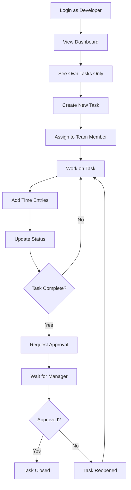
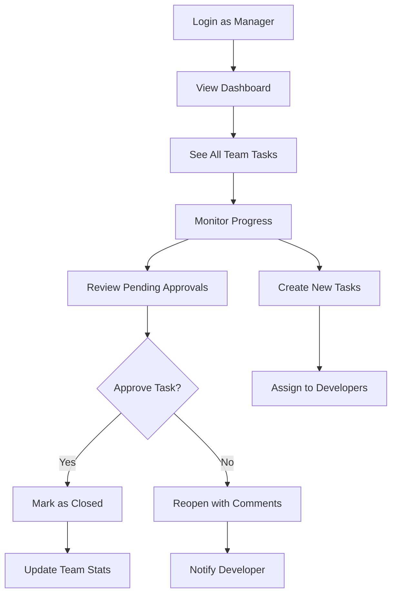

# 🐛 Bug/Task Tracker

<div align="center">


**A comprehensive, modern bug and task tracking application built with Next.js 14, featuring role-based authentication, time tracking, and a beautiful responsive UI.**

[🚀 Live Demo](#) • [📖 Documentation](#) • [🐛 Report Bug](#) • [💡 Request Feature](#)

</div>

---

## 📋 Table of Contents

- [🎯 Overview](#-overview)
- [✨ Features](#-features)
- [🛠 Technology Stack](#-technology-stack)
- [📁 Project Structure](#-project-structure)
- [🚀 Getting Started](#-getting-started)
- [💻 Installation](#-installation)
- [🔧 Configuration](#-configuration)
- [🏃‍♂️ Running Locally](#️-running-locally)
- [👤 User Roles & Permissions](#-user-roles--permissions)
- [🔐 Demo Credentials](#-demo-credentials)
- [📱 Responsive Design](#-responsive-design)
- [🎨 UI Components](#-ui-components)
- [📊 State Management](#-state-management)
- [🔄 Workflow](#-workflow)
- [🚀 Deployment](#-deployment)
- [🧪 Testing](#-testing)
- [🤝 Contributing](#-contributing)
- [🐛 Troubleshooting](#-troubleshooting)
- [🔮 Future Enhancements](#-future-enhancements)
- [📄 License](#-license)

---

## 🎯 Overview

The **Bug/Task Tracker** is a full-featured project management application designed for development teams. It provides comprehensive task management, bug tracking, time monitoring, and team collaboration features with a beautiful, responsive interface that works seamlessly across all devices.

### Key Highlights
- 🔐 **Role-based Authentication** - Developer and Manager roles with specific permissions
- 📊 **Interactive Dashboard** - Real-time statistics and trend visualizations
- ⏱️ **Time Tracking** - Detailed time logging with historical analytics
- 🔄 **Approval Workflow** - Manager oversight for task completion
- 🌓 **Theme Support** - Dark/Light/System theme with persistence
- 📱 **Fully Responsive** - Mobile-first design that works everywhere
- 🎨 **Modern UI** - Built with ShadCN/UI components and Tailwind CSS

---

## ✨ Features

### 🔐 Authentication & Authorization
- [x] **Simple Login System** with mock authentication
- [x] **Role-based Access Control** (Developer/Manager)
- [x] **Persistent Sessions** with automatic logout
- [x] **Protected Routes** with authentication guards
- [x] **User Profile Management**

### 📊 Dashboard & Analytics
- [x] **Comprehensive Dashboard** with real-time statistics
- [x] **Task Statistics Cards** (Total, In Progress, High Priority, Time Spent)
- [x] **Interactive Charts** showing 7-day task trends
- [x] **Recent Tasks Overview** with quick actions
- [x] **Role-specific Data Filtering**

### 📋 Task & Bug Management
- [x] **Full CRUD Operations** (Create, Read, Update, Delete)
- [x] **Comprehensive Task Fields**:
  - Title, Description, Type (Bug/Feature/Enhancement/Task)
  - Priority (Low/Medium/High), Status (Open/In Progress/Testing/Pending Approval/Closed)
  - Assignee, Creator, Due Date, Time Tracking
- [x] **Advanced Filtering System**:
  - Status, Priority, Type, Assignee (Manager only)
  - Search functionality across title and description
- [x] **Multiple Sorting Options**:
  - Created Date, Updated Date, Due Date, Priority, Status
  - Ascending/Descending order toggle
- [x] **Task Detail Views** with complete information

### ⏱️ Time Tracking
- [x] **Time Entry Logging** with date, hours, minutes, and description
- [x] **Historical Time Entries** with detailed breakdown
- [x] **Automatic Time Summation** per task
- [x] **Manager Visibility** into team time tracking
- [x] **Time Analytics** and reporting

### 🔄 Workflow Management
- [x] **Status Progression** with validation rules
- [x] **Approval Workflow**:
  - Developers request approval for task closure
  - Managers can approve or reopen tasks
  - Pending approval state management
- [x] **Role-based Permissions**:
  - Developers: Manage own tasks, request approvals
  - Managers: View all tasks, approve/reject closures

### 🎨 User Interface & Experience
- [x] **Modern, Clean Design** using ShadCN/UI components
- [x] **Responsive Layout** (Mobile, Tablet, Desktop)
- [x] **Dark/Light Theme Toggle** with system preference detection
- [x] **Smooth Animations** and micro-interactions
- [x] **Intuitive Navigation** with breadcrumbs and quick actions
- [x] **Loading States** and error handling
- [x] **Form Validation** with user-friendly error messages

### 🔧 Technical Features
- [x] **Server-Side Rendering** with Next.js 14 App Router
- [x] **Client-Side State Management** with Zustand
- [x] **Component-based Architecture** with reusable UI components
- [x] **Type Safety** with proper PropTypes and validation
- [x] **Performance Optimization** with code splitting and lazy loading
- [x] **SEO Friendly** with proper meta tags and structure

---

## 🛠 Technology Stack

### Frontend Framework
- **[Next.js 14.2.15](https://nextjs.org/)** - React framework with App Router
- **[React 18.3.1](https://reactjs.org/)** - JavaScript library for building user interfaces

### Styling & UI
- **[Tailwind CSS 3.3.6](https://tailwindcss.com/)** - Utility-first CSS framework
- **[ShadCN/UI](https://ui.shadcn.com/)** - Re-usable components built with Radix UI
- **[Radix UI](https://www.radix-ui.com/)** - Low-level UI primitives
- **[Lucide React](https://lucide.dev/)** - Beautiful & consistent icon pack

### State Management
- **[Zustand 4.4.7](https://zustand-demo.pmnd.rs/)** - Small, fast, and scalable state management
- **[Zustand Persist](https://github.com/pmndrs/zustand)** - Persistence middleware

### Data Visualization
- **[Recharts 2.8.0](https://recharts.org/)** - Composable charting library for React

### Development Tools
- **[ESLint](https://eslint.org/)** - Code linting and formatting
- **[PostCSS](https://postcss.org/)** - CSS processing
- **[Autoprefixer](https://autoprefixer.github.io/)** - CSS vendor prefixing

### Utilities
- **[clsx](https://github.com/lukeed/clsx)** - Utility for constructing className strings
- **[tailwind-merge](https://github.com/dcastil/tailwind-merge)** - Merge Tailwind CSS classes
- **[date-fns](https://date-fns.org/)** - Modern JavaScript date utility library
- **[class-variance-authority](https://cva.style/)** - Creating variants with class names

---

## 📁 Project Structure

```
bug-tracker/
├── 📄 README.md                     # Project documentation
├── 📄 package.json                  # Dependencies and scripts
├── 📄 next.config.js                # Next.js configuration
├── 📄 tailwind.config.js            # Tailwind CSS configuration
├── 📄 postcss.config.js             # PostCSS configuration
├── 📄 components.json               # ShadCN/UI configuration
├── 📄 .eslintrc.json               # ESLint configuration
├── 📄 .gitignore                   # Git ignore rules
├── 📁 public/                      # Static assets
│   └── 📄 favicon.ico
├── 📁 src/                         # Source code
│   ├── 📁 app/                     # Next.js App Router
│   │   ├── 📄 globals.css          # Global styles and CSS variables
│   │   ├── 📄 layout.js            # Root layout component
│   │   ├── 📄 page.js              # Home page
│   │   ├── 📁 login/               # Authentication pages
│   │   │   └── 📄 page.js          # Login page
│   │   ├── 📁 dashboard/           # Dashboard pages
│   │   │   └── 📄 page.js          # Main dashboard
│   │   └── 📁 tasks/               # Task management pages
│   │       ├── 📄 page.js          # Task list page
│   │       ├── 📁 new/             # New task creation
│   │       │   └── 📄 page.js      # New task form
│   │       └── 📁 [id]/            # Dynamic task routes
│   │           ├── 📄 page.js      # Task details
│   │           └── 📁 edit/        # Task editing
│   │               └── 📄 page.js  # Edit task form
│   ├── 📁 components/              # Reusable React components
│   │   ├── 📁 ui/                  # ShadCN/UI base components
│   │   │   ├── 📄 button.jsx       # Button component
│   │   │   ├── 📄 input.jsx        # Input component
│   │   │   ├── 📄 card.jsx         # Card component
│   │   │   ├── 📄 badge.jsx        # Badge component
│   │   │   ├── 📄 select.jsx       # Select dropdown
│   │   │   ├── 📄 textarea.jsx     # Textarea component
│   │   │   ├── 📄 dialog.jsx       # Modal dialog
│   │   │   ├── 📄 label.jsx        # Form label
│   │   │   ├── 📄 tabs.jsx         # Tab navigation
│   │   │   └── 📄 dropdown-menu.jsx # Dropdown menu
│   │   ├── 📄 theme-provider.jsx   # Theme context provider
│   │   ├── 📄 theme-toggle.jsx     # Dark/light mode toggle
│   │   ├── 📄 login-form.jsx       # Login form component
│   │   ├── 📁 dashboard/           # Dashboard-specific components
│   │   │   ├── 📄 dashboard-stats.jsx  # Statistics cards
│   │   │   ├── 📄 task-chart.jsx       # Task trend charts
│   │   │   └── 📄 recent-tasks.jsx     # Recent tasks list
│   │   ├── 📁 tasks/               # Task-related components
│   │   │   ├── 📄 task-list.jsx        # Task grid display
│   │   │   ├── 📄 task-card.jsx        # Individual task card
│   │   │   ├── 📄 task-form.jsx        # Task creation/editing form
│   │   │   ├── 📄 task-filters.jsx     # Filtering and sorting
│   │   │   └── 📄 time-tracker.jsx     # Time tracking component
│   │   ├── 📁 navigation/          # Navigation components
│   │   │   └── 📄 navbar.jsx       # Main navigation bar
│   │   └── 📁 auth/                # Authentication components
│   │       └── 📄 auth-guard.jsx   # Route protection
│   ├── 📁 store/                   # Zustand state management
│   │   ├── 📄 auth-store.js        # Authentication state
│   │   ├── 📄 task-store.js        # Task management state
│   │   └── 📄 theme-store.js       # Theme preference state
│   ├── 📁 lib/                     # Utility functions and constants
│   │   ├── 📄 utils.js             # Common utility functions
│   │   ├── 📄 constants.js         # Application constants
│   │   └── 📄 mock-data.js         # Sample data for demo
│   └── 📁 hooks/                   # Custom React hooks
│       ├── 📄 use-auth.js          # Authentication hook
│       └── 📄 use-tasks.js         # Task management hook
```

### 📁 Component Organization

#### 🎨 UI Components (`src/components/ui/`)
Base components from ShadCN/UI library, providing consistent design system:
- Form elements (Button, Input, Select, Textarea)
- Layout components (Card, Dialog, Tabs)
- Data display (Badge, Table)
- Navigation (Dropdown Menu)

#### 🏠 Dashboard Components (`src/components/dashboard/`)
- **dashboard-stats.jsx** - Statistics cards showing task counts and metrics
- **task-chart.jsx** - Interactive charts for task trends and analytics
- **recent-tasks.jsx** - Recent task activity with quick actions

#### 📋 Task Components (`src/components/tasks/`)
- **task-list.jsx** - Grid layout displaying filtered tasks
- **task-card.jsx** - Individual task card with actions and status
- **task-form.jsx** - Form for creating and editing tasks
- **task-filters.jsx** - Advanced filtering and sorting controls
- **time-tracker.jsx** - Time entry and tracking functionality

#### 🧭 Navigation Components (`src/components/navigation/`)
- **navbar.jsx** - Main application navigation with user menu

#### 🔐 Auth Components (`src/components/auth/`)
- **auth-guard.jsx** - Higher-order component for route protection

---

## 🚀 Getting Started

### Prerequisites

Before you begin, ensure you have the following installed on your local machine:

- **Node.js** (version 18.0 or higher)
- **npm** (version 8.0 or higher) or **yarn** (version 1.22 or higher)
- **Git** for version control

You can check your current versions by running:
```bash
node --version
npm --version
git --version
```

### System Requirements

- **Operating System**: Windows 10+, macOS 10.15+, or Linux
- **Memory**: 4GB RAM minimum, 8GB recommended
- **Storage**: 500MB free space for dependencies

---

## 💻 Installation

### Option 1: Clone the Repository

```bash
# Clone the repository
git clone https://github.com/your-username/bug-tracker.git

# Navigate to project directory
cd bug-tracker

# Install dependencies with legacy peer deps flag (recommended)
npm install --legacy-peer-deps

# Or if you prefer yarn
yarn install
```

### Option 2: Download ZIP

1. Download the project ZIP file from GitHub
2. Extract to your desired directory
3. Open terminal in the project folder
4. Run `npm install --legacy-peer-deps`

### Dependency Installation Notes

⚠️ **Important**: Use the `--legacy-peer-deps` flag to avoid peer dependency conflicts:

```bash
# Recommended installation command
npm install --legacy-peer-deps
```

If you encounter issues, try:
```bash
# Clear npm cache
npm cache clean --force

# Delete node_modules and package-lock.json
rm -rf node_modules package-lock.json

# Reinstall dependencies
npm install --legacy-peer-deps
```

---

## 🔧 Configuration

### Environment Setup

The application uses mock data and doesn't require environment variables for basic functionality. However, you can create a `.env.local` file for customization:

```bash
# .env.local (optional)
NEXT_PUBLIC_APP_NAME="Bug Tracker"
NEXT_PUBLIC_APP_VERSION="1.0.0"
NEXT_PUBLIC_APP_DESCRIPTION="Comprehensive Bug and Task Tracking"
```

### Tailwind CSS Configuration

The project uses a custom Tailwind configuration with CSS variables for theming. Key files:

- `tailwind.config.js` - Main Tailwind configuration
- `src/app/globals.css` - CSS variables for light/dark themes
- `components.json` - ShadCN/UI configuration

### Next.js Configuration

- `next.config.js` - Next.js configuration (minimal setup)
- App Router is enabled by default in Next.js 14

---

## 🏃‍♂️ Running Locally

### Development Server

Start the development server:

```bash
# Using npm
npm run dev

# Using yarn
yarn dev

# Using pnpm
pnpm dev
```

The application will be available at:
- **Local**: http://localhost:3000
- **Network**: http://[your-ip]:3000

### Build Commands

```bash
# Build for production
npm run build

# Start production server
npm run start

# Run linting
npm run lint
```

### Development Workflow

1. **Start development server**: `npm run dev`
2. **Open browser**: Navigate to http://localhost:3000
3. **Login with demo credentials** (see Demo Credentials section)
4. **Start developing**: Make changes and see live updates
5. **Check console**: Monitor for any errors or warnings

---

## 👤 User Roles & Permissions

### 👨‍💻 Developer Role

**Capabilities:**
- ✅ View and manage their own assigned tasks
- ✅ Create new tasks and assign to team members
- ✅ Edit their own tasks (title, description, priority, status, due date)
- ✅ Add time entries to their tasks
- ✅ Request approval for task completion
- ✅ Filter and sort their task list
- ✅ View personal dashboard with their statistics

**Restrictions:**
- ❌ Cannot view tasks assigned to other developers
- ❌ Cannot approve task completions
- ❌ Cannot delete tasks (only edit)
- ❌ Cannot change task assignee once assigned

### 👨‍💼 Manager Role

**Capabilities:**
- ✅ View all tasks across the entire team
- ✅ Create tasks and assign to any team member
- ✅ Edit any task in the system
- ✅ Approve or reject task completion requests
- ✅ Reopen closed tasks if needed
- ✅ View time tracking for all team members
- ✅ Access comprehensive team dashboard
- ✅ Filter tasks by assignee to monitor individual performance
- ✅ Manage pending approval requests

**Additional Features:**
- 📊 Team-wide analytics and reporting
- 👥 Assignee filtering in task lists
- ⏰ Team time tracking overview
- 🎯 Approval workflow management

---

## 🔐 Demo Credentials

The application includes mock authentication with pre-configured user accounts:

### 👨‍💻 Developer Account #1
```
Email: dev@example.com
Password: dev123
Name: John Developer
Role: Developer
```

### 👨‍💻 Developer Account #2
```
Email: dev2@example.com
Password: dev123
Name: Alice Developer
Role: Developer
```

### 👨‍💼 Manager Account
```
Email: manager@example.com
Password: manager123
Name: Jane Manager
Role: Manager
```

### Quick Login Tips
- Use the demo credentials provided on the login page
- Login state persists across browser sessions
- No actual authentication server required - fully client-side demo

---

## 📱 Responsive Design

### 📱 Mobile (320px - 768px)
- **Navigation**: Collapsible mobile menu
- **Task Cards**: Single column layout
- **Forms**: Stacked form fields
- **Dashboard**: Vertically stacked statistics
- **Tables**: Horizontal scroll for data tables

### 💻 Tablet (768px - 1024px)
- **Task Grid**: 2-column task card layout
- **Navigation**: Horizontal navigation bar
- **Forms**: 2-column form layout where appropriate
- **Dashboard**: 2x2 statistics grid

### 🖥️ Desktop (1024px+)
- **Task Grid**: 3-column task card layout
- **Full Navigation**: Complete navigation with all options
- **Forms**: Optimized multi-column layouts
- **Dashboard**: Full grid layout with charts
- **Sidebar**: Additional navigation options

### Responsive Features
- ✅ **Touch-friendly**: Large tap targets for mobile
- ✅ **Adaptive Text**: Appropriate text sizes for each device
- ✅ **Flexible Grids**: CSS Grid and Flexbox for layout
- ✅ **Image Optimization**: Responsive images with Next.js
- ✅ **Performance**: Optimized for mobile networks

---

## 🎨 UI Components

### Design System

The application uses a comprehensive design system based on ShadCN/UI:

#### Color Palette
- **Primary**: Blue (#3B82F6) - Actions, links, primary buttons
- **Secondary**: Gray (#6B7280) - Secondary text, borders
- **Success**: Green (#10B981) - Success states, completed items
- **Warning**: Yellow (#F59E0B) - Warnings, pending states
- **Error**: Red (#EF4444) - Errors, destructive actions
- **Muted**: Gray (#9CA3AF) - Subtle text, disabled states

#### Typography
- **Headings**: Inter font family, various weights
- **Body Text**: Inter font family, regular weight
- **Code**: Monospace font family for technical content

#### Component Variants
- **Buttons**: Default, destructive, outline, secondary, ghost, link
- **Cards**: Default, with headers, with footers
- **Badges**: Default, secondary, destructive, outline
- **Inputs**: Text, email, password, date, number, textarea

### Theme System

#### Light Theme
- Clean, bright interface with high contrast
- White backgrounds with subtle gray borders
- Dark text on light backgrounds

#### Dark Theme
- Modern dark interface easy on the eyes
- Dark gray backgrounds with subtle borders
- Light text on dark backgrounds

#### System Theme
- Automatically follows OS preference
- Seamless switching based on system settings
- Respects user's preferred color scheme

---

## 📊 State Management

### Zustand Stores

#### 🔐 Auth Store (`src/store/auth-store.js`)
Manages user authentication and session state:

```javascript
{
  user: null | {
    id: string,
    email: string,
    name: string,
    role: 'developer' | 'manager'
  },
  isLoading: boolean,
  error: string | null,
  login: (email, password) => Promise,
  logout: () => void,
  clearError: () => void
}
```

#### 📋 Task Store (`src/store/task-store.js`)
Manages all task-related state and operations:

```javascript
{
  tasks: Array<Task>,
  filters: {
    status: string,
    priority: string,
    assignee: string,
    type: string,
    search: string
  },
  sortBy: string,
  sortOrder: 'asc' | 'desc',
  
  // CRUD Operations
  createTask: (taskData) => Task,
  updateTask: (taskId, updates) => void,
  deleteTask: (taskId) => void,
  
  // Time Tracking
  addTimeEntry: (taskId, timeEntry) => void,
  
  // Workflow
  requestApproval: (taskId) => void,
  approveTask: (taskId) => void,
  reopenTask: (taskId) => void,
  
  // Filtering & Sorting
  setFilters: (filters) => void,
  setSorting: (sortBy, sortOrder) => void,
  clearFilters: () => void,
  
  // Getters
  getFilteredTasks: (userRole, userId) => Array<Task>,
  getTaskStats: (userRole, userId) => Object,
  getChartData: (userRole, userId) => Array<Object>
}
```

#### 🎨 Theme Store (`src/store/theme-store.js`)
Manages theme preferences:

```javascript
{
  theme: 'light' | 'dark' | 'system',
  setTheme: (theme) => void
}
```

### Data Flow

1. **Components** subscribe to store updates
2. **User actions** trigger store methods
3. **Store updates** cause component re-renders
4. **Persistence** automatically saves auth and theme state
5. **Filters** are applied in real-time to task lists

---

## 🔄 Workflow

### Developer Workflow



### Manager Workflow



### Task Status Flow

```
Open → In Progress → Testing → Pending Approval → Closed
  ↑         ↑           ↑            ↑             ↓
  ←---------←-----------←------------←----------Reopen
```

---

## 🚀 Deployment

### Vercel (Recommended)

Vercel provides the best experience for Next.js applications:

1. **Push to GitHub**:
   ```bash
   git add .
   git commit -m "Initial commit"
   git push origin main
   ```

2. **Deploy on Vercel**:
   - Visit [vercel.com](https://vercel.com)
   - Import your GitHub repository
   - Deploy with zero configuration

3. **Custom Domain** (Optional):
   - Add your domain in Vercel dashboard
   - Update DNS settings as instructed

### Other Deployment Options

#### Netlify
```bash
# Build the application
npm run build

# Deploy build folder to Netlify
# Upload 'out' folder or connect GitHub repo
```

#### Railway
```bash
# Install Railway CLI
npm install -g @railway/cli

# Login and deploy
railway login
railway init
railway up
```

#### Traditional Hosting
```bash
# Build for static export
npm run build

# Upload build files to your hosting provider
```

### Environment Variables for Production

For production deployment, set these environment variables:

```bash
NODE_ENV=production
NEXT_PUBLIC_APP_URL=https://your-domain.com
```

---

## 🧪 Testing

### Manual Testing Checklist

#### Authentication
- [ ] Login with developer credentials
- [ ] Login with manager credentials
- [ ] Logout functionality
- [ ] Session persistence
- [ ] Protected route access

#### Task Management
- [ ] Create new task
- [ ] Edit existing task
- [ ] Delete task (if permissions allow)
- [ ] Filter tasks by status
- [ ] Filter tasks by priority
- [ ] Search tasks by title/description
- [ ] Sort tasks by different criteria

#### Time Tracking
- [ ] Add time entry to task
- [ ] View time entry history
- [ ] Time calculations are correct
- [ ] Manager can view team time

#### Workflow
- [ ] Developer requests approval
- [ ] Manager approves task
- [ ] Manager reopens task
- [ ] Status transitions work correctly

#### UI/UX
- [ ] Responsive design on mobile
- [ ] Dark/light theme toggle
- [ ] Loading states display
- [ ] Error handling works
- [ ] Form validation functions

### Automated Testing (Future Enhancement)

```bash
# Install testing dependencies
npm install --save-dev jest @testing-library/react @testing-library/jest-dom

# Run tests
npm test

# Run tests with coverage
npm run test:coverage
```

---

## 🤝 Contributing

We welcome contributions to the Bug/Task Tracker! Here's how you can help:

### Development Setup

1. **Fork the repository**
2. **Clone your fork**:
   ```bash
   git clone https://github.com/your-username/bug-tracker.git
   ```
3. **Create a feature branch**:
   ```bash
   git checkout -b feature/amazing-feature
   ```
4. **Install dependencies**:
   ```bash
   npm install --legacy-peer-deps
   ```

### Making Changes

1. **Follow the existing code style**
2. **Write meaningful commit messages**
3. **Add comments to complex code**
4. **Test your changes thoroughly**
5. **Update documentation if needed**

### Submitting Changes

1. **Commit your changes**:
   ```bash
   git commit -m "Add: Amazing new feature"
   ```
2. **Push to your fork**:
   ```bash
   git push origin feature/amazing-feature
   ```
3. **Create a Pull Request**
4. **Describe your changes** in the PR description
5. **Wait for review** and address feedback

### Code Style Guidelines

- Use **meaningful variable names**
- Follow **React best practices**
- Write **clean, readable code**
- Add **proper error handling**
- Include **helpful comments**

### Areas for Contribution

- 🐛 **Bug fixes**
- ✨ **New features**
- 📚 **Documentation improvements**
- 🎨 **UI/UX enhancements**
- ⚡ **Performance optimizations**
- 🧪 **Test coverage**

---

## 🐛 Troubleshooting

### Common Issues and Solutions

#### Installation Issues

**Problem**: `npm install` fails with peer dependency errors
```bash
# Solution: Use legacy peer deps flag
npm install --legacy-peer-deps

# Or clear cache and reinstall
npm cache clean --force
rm -rf node_modules package-lock.json
npm install --legacy-peer-deps
```

**Problem**: Tailwind CSS styles not loading
```bash
# Check if these files exist and have correct content:
# - tailwind.config.js
# - src/app/globals.css
# - postcss.config.js

# Restart development server
npm run dev
```

#### Runtime Issues

**Problem**: Tasks disappear after editing
```
Solution: This was a known issue that has been fixed. Ensure you're using the latest version of the task-form.jsx component.
```

**Problem**: Charts not displaying data
```
Solution: The chart shows data for the last 7 days. The mock data uses old dates, so the chart generates sample data for demonstration.
```

**Problem**: Theme toggle not working
```
Solution: Check that the ThemeProvider wraps your app in layout.js and that localStorage is available.
```

#### Browser Compatibility

**Supported Browsers**:
- Chrome 88+
- Firefox 85+
- Safari 14+
- Edge 88+

**Problem**: Application not working in older browsers
```
Solution: The application uses modern JavaScript features. Please update your browser or use a supported version.
```

### Getting Help

1. **Check this README** for solutions
2. **Search existing issues** on GitHub
3. **Create a new issue** with detailed information
4. **Include error messages** and browser console output
5. **Provide steps to reproduce** the problem

### Debug Mode

Enable debug mode by opening browser console (F12) and running:
```javascript
localStorage.setItem('debug', 'true')
```

This will show additional logging information to help diagnose issues.

---

## 🔮 Future Enhancements

### Planned Features

#### 🗄️ Backend Integration
- [ ] **Database Integration** (PostgreSQL/MongoDB)
- [ ] **RESTful API** development
- [ ] **Authentication** with JWT tokens
- [ ] **Real-time updates** with WebSockets
- [ ] **File upload** for task attachments

#### 👥 Team Management
- [ ] **Team creation** and management
- [ ] **Project organization** and grouping
- [ ] **User roles** expansion (Admin, Team Lead, etc.)
- [ ] **Permission system** enhancement
- [ ] **Team analytics** and reporting

#### 📊 Advanced Analytics
- [ ] **Detailed reporting** dashboard
- [ ] **Time tracking** analytics
- [ ] **Performance metrics** for developers
- [ ] **Burndown charts** and velocity tracking
- [ ] **Export functionality** (PDF, Excel)

#### 🔗 Integrations
- [ ] **GitHub integration** for code commits
- [ ] **Slack notifications** for updates
- [ ] **Email notifications** system
- [ ] **Calendar integration** for due dates
- [ ] **Webhook support** for external systems

#### 📱 Mobile Application
- [ ] **React Native app** for iOS/Android
- [ ] **Push notifications** for mobile
- [ ] **Offline support** with sync
- [ ] **Mobile-optimized** workflows

#### 🔒 Security Enhancements
- [ ] **Two-factor authentication** (2FA)
- [ ] **Role-based permissions** system
- [ ] **Activity logging** and audit trails
- [ ] **Data encryption** at rest
- [ ] **GDPR compliance** features

#### 🎨 UI/UX Improvements
- [ ] **Drag-and-drop** task management
- [ ] **Keyboard shortcuts** for power users
- [ ] **Custom themes** and branding
- [ ] **Advanced filtering** with saved searches
- [ ] **Bulk operations** for tasks

#### ⚡ Performance Optimizations
- [ ] **Server-side rendering** optimization
- [ ] **Image optimization** and lazy loading
- [ ] **Code splitting** improvements
- [ ] **Caching strategies** implementation
- [ ] **Performance monitoring** integration

### Technical Improvements

#### 🧪 Testing
- [ ] **Unit tests** with Jest
- [ ] **Integration tests** with React Testing Library
- [ ] **End-to-end tests** with Playwright
- [ ] **Visual regression tests**
- [ ] **Performance testing**

#### 🔄 DevOps
- [ ] **CI/CD pipeline** setup
- [ ] **Automated deployment** workflows
- [ ] **Environment management**
- [ ] **Monitoring and logging**
- [ ] **Error tracking** with Sentry

#### 📚 Documentation
- [ ] **API documentation** with OpenAPI
- [ ] **Component documentation** with Storybook
- [ ] **Video tutorials** for users
- [ ] **Developer guides** and best practices
- [ ] **Deployment guides** for different platforms

---

## 📄 License

This project is licensed under the **MIT License** - see the [LICENSE](LICENSE) file for details.

### MIT License Summary

- ✅ **Commercial use** allowed
- ✅ **Modification** allowed
- ✅ **Distribution** allowed
- ✅ **Private use** allowed
- ❗ **License and copyright notice** required
- ❌ **No warranty** provided
- ❌ **No liability** for damages

### Third-Party Licenses

This project uses several open-source libraries. Please refer to their respective licenses:

- **Next.js** - MIT License
- **React** - MIT License
- **Tailwind CSS** - MIT License
- **Radix UI** - MIT License
- **Zustand** - MIT License
- **Recharts** - MIT License

---

## 📞 Support & Contact

### Getting Support

- 📚 **Documentation**: Check this README first
- 🐛 **Bug Reports**: Create an issue on GitHub
- 💡 **Feature Requests**: Create an issue with the "enhancement" label
- ❓ **Questions**: Create an issue with the "question" label

### Project Maintainers

- **Primary Maintainer**: [Your Name](mailto:your.email@example.com)
- **Contributors**: See [Contributors](https://github.com/your-username/bug-tracker/contributors)

### Community

- 🌟 **Star the project** if you find it useful
- 🍴 **Fork the project** to contribute
- 📢 **Share the project** with others
- 🤝 **Contribute** to make it better

---

## 🙏 Acknowledgments

Special thanks to:

- **[Vercel](https://vercel.com)** for providing excellent hosting and deployment tools
- **[ShadCN](https://ui.shadcn.com)** for the beautiful and accessible UI components
- **[Tailwind CSS](https://tailwindcss.com)** for the utility-first CSS framework
- **[Next.js](https://nextjs.org)** team for the amazing React framework
- **[Zustand](https://zustand-demo.pmnd.rs)** for the simple and effective state management
- **[Lucide](https://lucide.dev)** for the consistent and beautiful icons

---

<div align="center">

**Built with ❤️ using Next.js, React, and Tailwind CSS**

[⬆ Back to Top](#-bugtask-tracker)

</div>